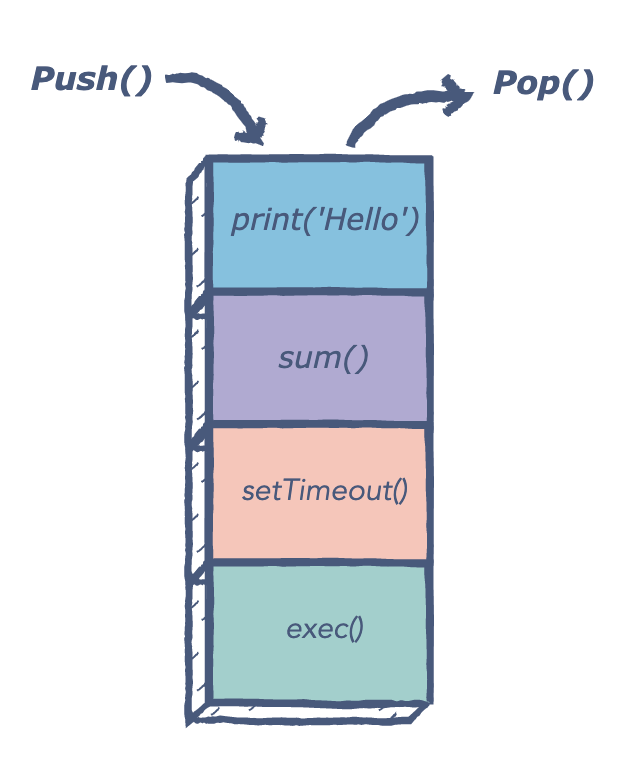
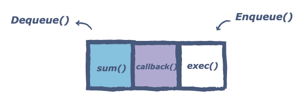
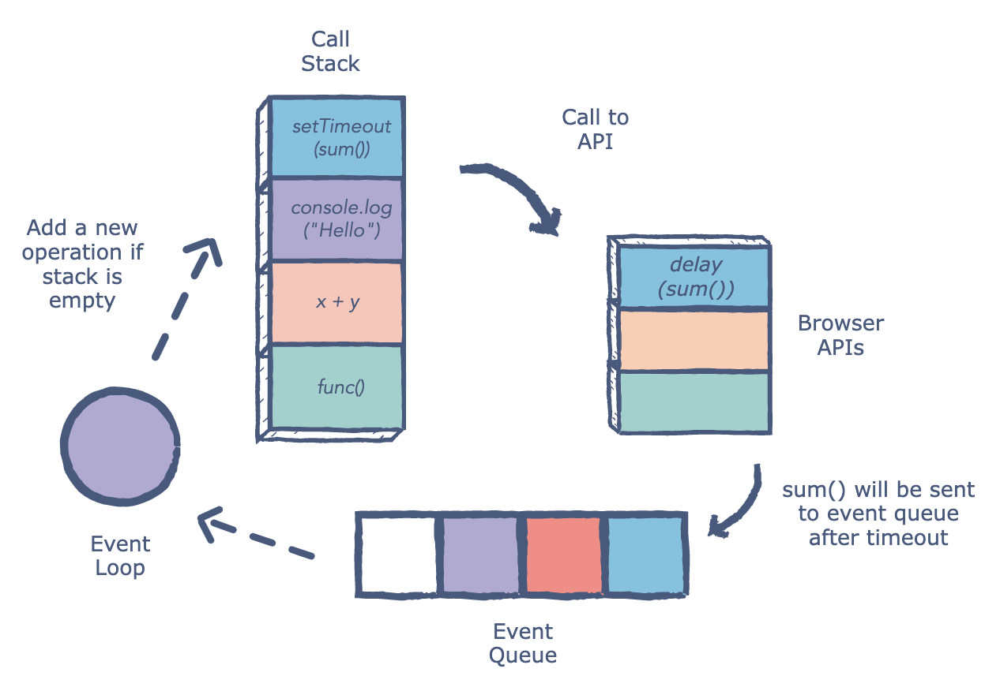

# JavaScript Concepts & frequently asked Interview Questions

## Table of Contents  
[What is event loop in JavaScript?](#Q1)  
[Explain Closure with an example.](#Q2)  
[What is Hoisting in JavaScript?](#Q3)   
[bind()](#Q4)    
[call()](#Q5)    
[apply()](#Q6)    
[Do setTimeOut and setInterval always call the function associated with them?](#Q7)   
[null vs undefined](#Q8)    
[What are classes in JavaScript?](#Q9)    


<a name="Q1"/>

### What is event loop in JavaScript?
The **_event loop_** is the secret behind JavaScript’s asynchronous programming. JS executes all operations on a single thread, but using a few smart data structures, it gives us the illusion of multi-threading. Let’s take a look at what happens on the back-end.

The **_call stack_** is responsible for keeping track of all the operations in line to be executed. Whenever a function is finished, it is popped from the stack.

<br>
<p align="center">
  
</p>

The **_event queue_** is responsible for sending new functions to the track for processing. It follows the queue data structure to maintain the correct sequence in which all operations should be sent for execution.

<br>
<p align="center">
  
</p>

Whenever an async function is called, it is sent to a browser API. These are APIs built into the browser. Based on the command received from the call stack, the API starts its own single-threaded operation.

An example of this is the `setTimeout` method. When a `setTimeout` operation is processed in the stack, it is sent to the corresponding API which waits till the specified time to send this operation back in for processing.

Where does it send the operation? The event queue. Hence, we have a cyclic system for running async operations in JavaScript. The language itself is single-threaded, but the browser APIs act as separate threads.

The **_event loop_** facilitates this process; it constantly checks whether or not the call stack is empty. If it is empty, new functions are added from the event queue. If it is not, then the current function call is processed.

<br>
<p align="center">
  
</p>

<br>
<br>

<a name="Q2"/>

### Closure with an example.
Suppose, you want to count the number of times user clicked a button on a webpage.
For this, you are triggering a function on onclick event of button to update the count of the variable.

`<button onclick="updateClickCount()">click me</button>`

Now there could be many approaches like:

1. You could use a global variable, and a function to increase the counter:
```
 var counter = 0;

 function updateClickCount() {
     ++counter;
     // Do something with counter
 }
```
  But, the probblem with this approach is that any script on the page can change the counter, without calling updateClickCount().

2. Now, you might be thinking of declaring the variable inside the function:
```
 function updateClickCount() {
     var counter = 0;
     ++counter;
     // Do something with counter
 }
 ```
  But, hey! Every time updateClickCount() function is called, the counter is set to 1 again.
  
3. Thinking about nested functions?

  Nested functions have access to the scope "above" them.

  In this example, the inner function updateClickCount() has access to the counter variable in the parent function countWrapper():
  ```
   function countWrapper() {
       var counter = 0;
       function updateClickCount() {
           ++counter;
           // Do something with counter
       }
       updateClickCount();
       return counter;
   }
   ```
  This could have solved the counter dilemma, if you could reach the updateClickCount() function from the outside and you also need to find a way to execute counter = 0 only once not everytime.
  
  4. Closure to the rescue! (self-invoking function):
   ```
   var updateClickCount = (function(){
       var counter = 0;

       return function(){
           ++counter;
           // Do something with counter
       }
   })();
   ```
  The self-invoking function only runs once. It sets the counter to zero (0), and returns a function expression. This way updateClickCount becomes a function. The "wonderful" part is that it can access the counter in the parent scope. This is called a JavaScript closure. It makes it possible for a function to have "private" variables. The counter is protected by the scope of the anonymous function, and can only be changed using the add function!
  
#### A more lively example on closures
```
<script>
var updateClickCount = (function(){
    var counter = 0;

    return function(){
        ++counter;
        document.getElementById("spnCount").innerHTML = counter;
    }
})();
</script>

<html>
<button onclick="updateClickCount()">click me</button>
<div> you've clicked
    <span id="spnCount"> 0 </span> times!
</div>
</html>
```

<br>
<br>

<a name="Q3"/>

### What is hoisting in JavaScript?

Hoisting in JS is a phenomenon of accessing variables even before they are initialized. Before JS starts executing a piece of code, it skims through the code and allocates memory for all the variables and functions. So, if somewhere in the code, a variable x is defined and initialized; JS allocates the memory and assigns it a keyword undefined before even it executes that code. Hence, when you try to access it before it is initialized, it'll be undefined.

Hoisting is a JavaScript mechanism where variables and function declarations are moved to the top of their scope before code execution. Remember that JavaScript only hoists declarations, not initialisation.

```
console.log(message); //output : undefined
var message = 'The variable Has been hoisted';
```
The above code looks like as below to the interpreter,
```
var message;
console.log(message);
message = 'The variable Has been hoisted';
```

<br>
<br>

<a name="Q4"/>

### bind()

The ```bind()``` method returns a new function, when invoked, has its ```this``` set to a specific value.

The following illustrates the syntax of the ```bind()``` method:
```fn.bind(thisArg[, arg1[, arg2[, ...]]])```

In this syntax, the ```bind()``` method returns a copy of the function ```fn``` with the specific ```this``` value (```thisArg```) and arguments (```arg1```, ```arg2```, …).

> Unlike the call() and apply() methods, the bind() method doesn’t immediately execute the function. It just returns a new version of the function whose this sets to thisArg argument.

#### Using ```bind()``` for function binding
When you pass a method an object is to another function as a callback, the this is lost. For example:

```
let person = {
    name: 'John Doe',
    getName: function() {
        console.log(this.name);
    }
};

setTimeout(person.getName, 1000);
```

Output:
```
undefined
```
As you can see clearly from the output, the ```person.getName()``` returns ```undefined``` instead of 'John Doe'. This is because ```setTimeout()``` received the function ```person.getName``` separately from the ```person``` object.

The statement:
```
setTimeout(person.getName, 1000);
```
can be rewritten as:
```
let f = person.getName;
setTimeout(f, 1000); // lost person context
```
The this inside the ```setTimeout()``` function is set to the ```global``` object in non-strict mode and ```undefined``` in the strict mode. Therefore, when the callback ```person.getName``` is invoked, the ```name``` does not exist in the ```global``` object, it is set to ```undefined```.

To fix this issue, use bind() to set the context:
```
let f = person.getName.bind(person);
setTimeout(f, 1000);
```
In this code:

First, bind the ```person.getName``` method to the ```person``` object.
Second, pass the bound function ```f``` with this value set to the person object to the ```setTimeout()``` function.

#### Using ```bind()``` to borrow methods from a different object
Suppose you have a runner object that has the run() method:
```
let runner = {
    name: 'Runner',
    run: function(speed) {
        console.log(this.name + ' runs at ' + speed + ' mph.');
    }
};
```

And the flyer object that has the fly() method:
```
let flyer = {
    name: 'Flyer',
    fly: function(speed) {
        console.log(this.name + ' flies at ' + speed + ' mph.');
    }
};
```

If you want the flyer object to be able to run, you can use the bind() method to create the run() function with the this  sets to the flyer object:
```
let run = runner.run.bind(flyer, 20);
run();
```
In this statement:

Call the bind() method of the runner.run() method and pass in the flyer object as the first argument and 20 as the second argument.
Invoke the run() function.

Output:
```
Flyer runs at 20 mph.
```
The ability to borrow a method of an object without making a copy of that method and maintain it in two separate places is very powerful in JavaScript.

#### Summary

-> The bind() method creates a new function, when invoked, has the this sets to a provided value.

-> The bind() method allows an object to borrow a method from another object without making a copy of that method. This is known as function borrowing in JavaScript.


<br>
<br>

<a name="Q5"/>

### call()

When calling `setTimeout` or `setInterval`, a timer thread in the browser starts counting down and when time up puts the callback function in JavaScript thread's execution stack. The callback function is not executed before other functions above it in the stack finishes. So if there are other time-consuming functions being executed when time up, the callback of `setTimeout` will not finish in time.

<br>
<br>

<a name="Q6"/>

### apply()

When calling `setTimeout` or `setInterval`, a timer thread in the browser starts counting down and when time up puts the callback function in JavaScript thread's execution stack. The callback function is not executed before other functions above it in the stack finishes. So if there are other time-consuming functions being executed when time up, the callback of `setTimeout` will not finish in time.

<br>
<br>

<a name="Q7"/>

### Do setTimeOut and setInterval always call the function associated with them?

When calling `setTimeout` or `setInterval`, a timer thread in the browser starts counting down and when time up puts the callback function in JavaScript thread's execution stack. The callback function is not executed before other functions above it in the stack finishes. So if there are other time-consuming functions being executed when time up, the callback of `setTimeout` will not finish in time.

<br>
<br>

<a name="Q8"/>

### null vs undefined

`null` is an assigned value. It means nothing. `undefined` typically means a variable has been declared but not defined yet.

<br>
<br>

<a name="Q9"/>

### What are classes in JavaScript?

Javascript classes are primarily syntactic sugar over JavaScript’s existing prototype-based inheritance. For example, the prototype based inheritance written in function expression as below:
```
function Bike(model,color) {
    this.model = model;
    this.color = color;
}

Bike.prototype.getDetails = function() {
    return this.model + ' bike has' + this.color + ' color';
};
```
Whereas ES6 classes can be defined as an alternative
```
class Bike{
  constructor(color, model) {
    this.color= color;
    this.model= model;
  }

  getDetails() {
    return this.model + ' bike has' + this.color + ' color';
  }
}
```
